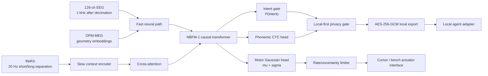
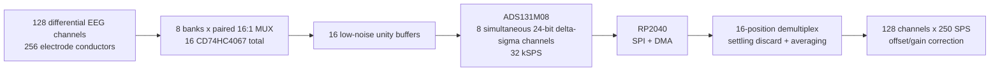

<!-- SPDX-License-Identifier: AGPL-3.0-only -->
# NBFM-1 Open BCI Stack


\n

Open-source research platform for a multimodal, non-invasive brain-computer interface built around three independently useful layers:

1. **NBFM-1** — an asynchronous neural foundation model with a millisecond-scale EEG/MEG fast path and a slower fNIRS context path.
2. **P1/P2 edge stack** — local inference, TensorRT/ONNX deployment, CUDA Graph-compatible I/O, encrypted local transport, intent gating, privacy zeroization, telemetry and systemd services.
3. **EEG128-TDM** — an ultra-low-cost 128-channel differential EEG acquisition architecture using paired 16:1 analog multiplexers, an 8-channel simultaneous-sampling delta-sigma ADC and an RP2040-class controller.

> **Research use only.** This repository does not claim medical-device certification, diagnostic suitability, prosthesis safety certification or validated free-form thought decoding. The `<5 ms` value is a compute-latency target measured after the required neural signal window is available, not a claim about neurophysiological response time.

## Defensive publication

The enabling technical disclosure is in [`PATENT_DISCLOSURE.md`](PATENT_DISCLOSURE.md). The document is intentionally explicit about timing, packet formats, signal routing, filter-settling handling, asynchronous multimodal fusion and privacy gating so the disclosed combinations can be independently implemented and searched as public technical literature.

A repository commit is evidence, not magic. For a stronger publication record, publish a signed release, generate the repository SHA-256 manifest and archive that release in a DOI-backed repository such as Zenodo. See [`docs/PUBLICATION_PROCEDURE.md`](docs/PUBLICATION_PROCEDURE.md).

## System architecture



### EEG128-TDM acquisition path



## Hardware revision status

The repository contains **EEG128-TDM Revision A0** KiCad/BOM/CPL/netlist sources, but A0 is **not released for fabrication or human-connected use**. The board still requires independent routing and footprint verification followed by clean KiCad 8 ERC/DRC and the safety release gates in [`docs/SAFETY_COMPLIANCE.md`](docs/SAFETY_COMPLIANCE.md).

The manufacturing exporter is fail-closed: [`hardware/eeg128-tdm/generate_manufacturing.py`](hardware/eeg128-tdm/generate_manufacturing.py) refuses to generate Gerber output while [`RELEASE_STATUS.json`](hardware/eeg128-tdm/RELEASE_STATUS.json) contains an unmet release gate.

## Privacy-state machine

```text
LOCKED --explicit local arm--> ARMED --P(intent) >= T_gate--> DECODING
   ^                          |                              |
   |                          +--below threshold------------+
   +---------------- timeout / lock / fault ----------------+
```

Speech logits remain local. When the gate is closed, the export tensor is replaced with a fixed-shape zero tensor before encryption. Frame dimensions therefore do not reveal whether a private speech hypothesis existed.

## Physical hardware release status

The repository contains the A0 KiCad project, logical netlist, BOM/CPL and fail-closed manufacturing tooling, but **A0 is not released for fabrication or human-connected use**.

The current audited EDA state has placement/net assignments but not completed copper routing, and the current schematic is a connectivity index rather than a complete instantiated circuit schematic. The authoritative release blockers are machine-readable in `hardware/eeg128-tdm/RELEASE_STATUS.json`.

Run:

```bash
python3 hardware/eeg128-tdm/validate_eda.py
```

Manufacturing export remains blocked until the independent physical release gates are satisfied.

See:

- `hardware/eeg128-tdm/EDA_AUDIT.md`
- `docs/SAFETY_COMPLIANCE.md`
- `docs/AUDIT_2026-10-05.md`

## Quick start

```bash
chmod +x deploy_bci_stack.sh
./deploy_bci_stack.sh
```

Run the latency auditor after inference and bridge services are healthy:

```bash
python3 bin/audit_latency.py \
  --json reports/latency-audit.json \
  --html reports/latency-audit.html
```

A benchmark is considered successful only when the measured P99 meets the configured threshold. The badge above states the **target**, not an unmeasured result.

## Licensing

Hardware design source and firmware are licensed under **CERN Open Hardware Licence Version 2 — Strongly Reciprocal (`CERN-OHL-S-2.0`)**. The NBFM-1 software architecture, inference stack, privacy gate, deployment code, scripts and project documentation are licensed under **GNU Affero General Public License v3.0 only (`AGPL-3.0-only`)**.

## Citation

Machine-readable citation metadata is in [`CITATION.cff`](CITATION.cff).

## Security

Neural raw data, derived embeddings, decoded speech, session keys, model weights and device-specific calibration can be sensitive. Never commit them. See [`SECURITY.md`](SECURITY.md) and the enforced exclusions in [`.gitignore`](.gitignore).
