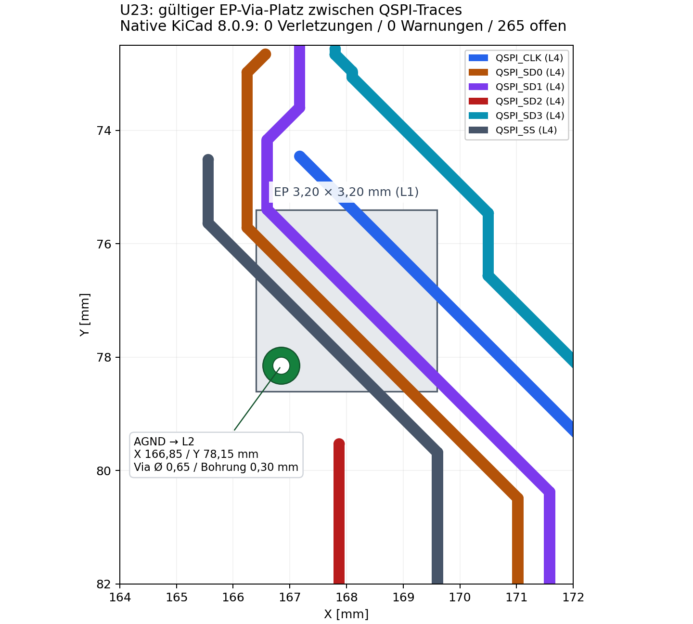

# RP2040 Escape und nativer Routing-Nachweis — 2026-10-06

**Zwischenstand: 0 DRC-Verletzungen, 0 Warnungen, 265 offene Verbindungen. Kein Abschluss und keine Fertigungsfreigabe.**

Das Exposed Pad von U23 hat jetzt einen direkten AGND-Kontakt zur durchgehenden L2-Fläche. Das beseitigt seinen isolierten Ground-Anschluss, schließt aber die verbliebenen Analognetze nicht automatisch.

## AP1 — tatsächliche, angenommene Geometrie

- U23 EP: Mittelpunkt (168,00 / 77,00) mm, 3,20 × 3,20 mm.
- Ein angenommenes EP-Via: (166,85 / 78,15) mm, Durchmesser 0,65 mm, Bohrung 0,30 mm, radialer Kupferring 0,175 mm, durchgehend F.Cu–B.Cu. Es kontaktiert AGND auf In1.Cu (L2).
- Native Luftlinien mit EP-Pin 57 als Endpunkt: 0. Offene QSPI-Verbindungen: 0.
- Die übrigen U23-Ground/Power-Pads sind getrennt vom EP zu bewerten; siehe echte Pin-Endpunkte in bottlenecks-latest.json.
- Der vollständige Bereich unter dem EP auf L4 ist weiterhin von QSPI-Leiterbahnen belegt. Der akzeptierte Via-Platz umgeht diese geometrisch. Eine vollständige Korridorfreigabe ist **nicht** nachgewiesen.

Getestete 3×3-Alternative: 0,60/0,30 mm Durchgangsvias, 0,90 mm Rastermaß; X = 167,10 / 168,00 / 168,90 mm und Y = 76,10 / 77,00 / 77,90 mm. Die Außenkante dieses Grids bleibt innerhalb des EP. 0,50 mm Via-Durchmesser würde die aktuelle globale Mindestregel 0,60 mm verletzen; sie wurde dafür nicht abgesenkt.

Das Grid allein löst L4-Kollisionen nicht, weil diese Vias bis B.Cu reichen. Sechs störende QSPI-Segmente wurden deshalb in einem atomaren Versuch entfernt. Das Grid verband EP und L2 ohne geometrische Fehler. Je nach Routing-Reihenfolge konnten Teile des QSPI-Busses neu verbunden werden, aber nicht alle sechs Netze mit null Warnungen. Alle Grid-Versuche wurden vollständig zurückgerollt; grid-rejected.json dokumentiert einen davon. Im angenommenen Board bleiben die bestehenden geschlossenen QSPI-Traces erhalten. Die frühere QSPI_SD3-Lücke war bereits geschlossen.

Eine gerade Verbindung U23-Pin 19 → EP kreuzt XIN_12M und dessen Via. Sie wurde wegen nativer Kurzschluss-/Bohrabstandsfehler verworfen. Der Routing-Algorithmus sucht stattdessen um diese Hindernisse zu vorhandenen Plane-Vias.



## Tatsächliche QSPI-Layerführung

Im Board heißt SCLK **QSPI_CLK**. Die Tabelle zeigt Kupfer-Mittellinienlängen; sie ist kein Timing-, Impedanz- oder Skew-Nachweis. Alle sechs Netze verwenden 0,20 mm Signalleiterbahnen. rp2040-escape.json enthält sämtliche Segment-Koordinaten, Breiten und Via-Positionen.

| Netz | L1 Länge mm | L4 Länge mm | Vias |
|---|---:|---:|---:|
| QSPI_CLK | 5.483 | 17.562 | 2 |
| QSPI_SD0 | 11.684 | 17.456 | 2 |
| QSPI_SD1 | 3.468 | 18.054 | 2 |
| QSPI_SD2 | 13.604 | 10.273 | 2 |
| QSPI_SD3 | 6.093 | 15.576 | 2 |
| QSPI_SS | 5.167 | 15.075 | 2 |

EP-Vias im Lötpad benötigen eine abgestimmte Füll-/Cap- und Pastenschablonen-Ausführung. Eine normale Durchgangsbohrung ist kein automatisch qualifizierter Via-in-Pad-Assembly-Prozess. Herstellerunterlagen: https://jlcpcb.com/capabilities/pcb-capabilities/ und https://jlcpcb.com/de/help/article/pcb-via-covering . RP2040-QSPI-Referenz: https://datasheets.raspberrypi.com/rp2040/hardware-design-with-rp2040.pdf .

## AP2 — offene Netze und ergänzte Routing-Strategie

| Gruppe | Offen |
|---|---:|
| POWER | 31 |
| AGND | 11 |
| TDM_ANALOG | 218 |
| MUX_CONTROL | 5 |

Der ursprüngliche 308er-Bericht umfasst 225 TDM-Analog-, 38 Power-, 26 AGND-, 16 MUX-, 1 QSPI- und 2 USB-Verbindungen. Überlappende Baugruppen-Endpunkte: U1–U16 159, U23 18, U21 4, Steckverbinder 88, passive/sonstige 135. Diese Endpunktgruppen dürfen nicht addiert werden. U17–U20 haben im 308er-Bericht keine direkten offenen Pad-Endpunkte; die vier offenen U21-Endpunkte sind Versorgung/Masse, nicht ADC-Analogeingänge.

route_targeted_closure.py nutzt L1 vorwiegend horizontal und L4 vorwiegend vertikal. Es kann bestehende Kupfer-Trunks entlang ihrer Länge anzapfen und weitere Punkte einer verbundenen Kupfergruppe als Escape-Anker nutzen. Der Suchplaner berücksichtigt auch die Clearance des Nachbarnetzes: Power/VCM/Analog-Referenzen erfordern 0,20 mm, auch wenn das geroutete CH-Netz selbst nur 0,15 mm fordert. Native Via-Abstandsfehler mit 0,175 mm statt 0,20 mm zu VCM wurden damit adressiert; CH118_P_ELECTRODE konnte im anschließenden diagnostischen Pass geschlossen werden. DRC-Regeln wurden dafür nicht abgeschwächt.

TDM-Traces bleiben mindestens 0,15 mm breit. QSPI bleibt 0,20 mm. Standard-Vias sind 0,65/0,30 mm. Die experimentellen U23-Power-Necks sind 0,15 mm breit und 0,80 mm lang; die passende ausdrücklich lokale Custom-Rule liegt im Paket, die globale Clearance bleibt erhalten.

Längere CH/BANK-Routen auf L4 sind ein Engineering-Versuch und bestehen nicht automatisch die bisherige Analog-Layer-Policy. Deshalb wurde dieses Board nicht in den konservativen 308er-Checkpoint oder in die primäre Fertigungs-PCB übernommen. Rückstrompfade, Paarführung und Analogqualität müssen vor einer Übernahme geprüft werden.

Ein längerer KiCad/SWIG-Suchlauf stürzte ab. Die darin verwendete Connectivity-Abfrage im Suchpfad wurde durch eine Kupfergeometrie-Suche ersetzt; die genaue Absturzursache ist nicht abschließend bewiesen. run_native_closure.py arbeitet zusätzlich mit isolierten, begrenzten Prozessen. Nach einem Absturz übernimmt es ausschließlich accepted.kicad_pcb und prüft diesen Stand in einem frischen nativen Prozess. Gleiche Prioritätsgruppen werden zwischen Arbeitsscheiben gedreht, damit blockierte kurze Netze nicht immer alle anderen Netze verdrängen.

## AP3 — Zonen-Fill und reale Inselprüfung

Der installierte native KiCad 8.0.9-CLI hat keinen Unterbefehl `pcb fill-zones`. Der tatsächliche Fill erfolgt mit `pcbnew.ZONE_FILLER(board).Fill(board.Zones())`; der DRC folgt danach über kicad-cli. Jede angenommene Änderung erfordert null native DRC-Verletzungen/Warnungen und weniger offene Verbindungen. Projekt-Netzklassen werden vor jedem nativen DRC aus dem unveränderten Original wiederhergestellt, weil LoadBoard/SaveBoard sonst ein Default-Projekt erzeugen kann.

| Netz | Layer | Gefüllte Insel | Via-Kontakte | Thermal-Gap mm | Spoke mm |
|---|---|---:|---:|---:|---:|
| AGND | In1.Cu | 0 | 137 | 0.200 | 0.250 |
| 3V3A | In2.Cu | 0 | 23 | 0.200 | 0.250 |
| 5V_ISO | In2.Cu | 0 | 7 | 0.200 | 0.250 |
| 3V3D | In2.Cu | 0 | 16 | 0.200 | 0.250 |

Es existiert eine AGND-Fläche auf L2 und je eine Power-Fläche auf L3, keine L1-/L4-Zonen. Alle gefüllten Inseln haben mindestens einen gleichnamigen Via-Kontakt. Das ist ein Inselkontakt-Nachweis, kein Beweis für die Anbindung aller Bauteilpads; die verbleibenden Power-/AGND-Luftlinien bleiben reale Blocker. Power-Inseln werden niemals mit AGND kurzgeschlossen.

## Reproduzierbare Befehle

KiCad 8, python3-pcbnew (mit KiCad geliefert), python3-numpy und python3-shapely müssen verfügbar sein. Vom Repository-Root:

```sh
mkdir -p /tmp/eeg128-native-input
unzip hardware/eeg128-tdm/engineering/latest-pcb.zip -d /tmp/eeg128-native-input
/usr/bin/python3 hardware/eeg128-tdm/fill_zones.py /tmp/eeg128-native-input/eeg128-tdm.kicad_pcb
kicad-cli pcb drc --format json --severity-all --all-track-errors \
  --output /tmp/eeg128-native-input/drc.json /tmp/eeg128-native-input/eeg128-tdm.kicad_pcb
/usr/bin/python3 hardware/eeg128-tdm/route_rp2040_escape.py \
  --board /tmp/eeg128-native-input/eeg128-tdm.kicad_pcb --output-dir /tmp/eeg128-grid --seconds 600
/usr/bin/python3 hardware/eeg128-tdm/run_native_closure.py \
  --board /tmp/eeg128-native-input/eeg128-tdm.kicad_pcb --output-dir /tmp/eeg128-signals \
  --mode signals --seconds 2400 --allow-bottom-analog --qfn-power-neckdown
```

Das Paket enthält genau PCB, Projekt und angewendete Custom-Rules unter demselben Dateistamm. STATUS.json enthält SHA-256 für jedes Paketmitglied und den ZIP-Container. Hardware-Identität/BOM/CPL: 642 Positionen, PASS (hardware-identity.json).

## AP4 — tatsächlicher nativer Kopfbericht und Release-Status

```json
{
  "kicad_version": "8.0.9",
  "date": "2026-10-06T22:19:00+0100",
  "source": "eeg128-tdm.kicad_pcb",
  "violations": 0,
  "warnings": 0,
  "unconnected": 265
}
```

`routing_completed=false`, `fabrication_release=false`. Die primäre Manufacturing-PCB wurde nicht ersetzt; ihre bisherigen 499 offenen Verbindungen bleiben als primärer Audit erhalten. RELEASE_STATUS.json ergänzt einen ausdrücklich separaten Engineering-Audit. Der neue A2 Targeted Native Routing Closure Workflow speichert auch abgelehnte Versuche und native Berichte als Artefakt und schlägt beim Abschluss-Gate fehl, solange Verletzungen, Warnungen oder offene Verbindungen ungleich null sind. Ein erfolgreich gelaufener Teilprozess wird nicht als fertige Entflechtung bezeichnet.
